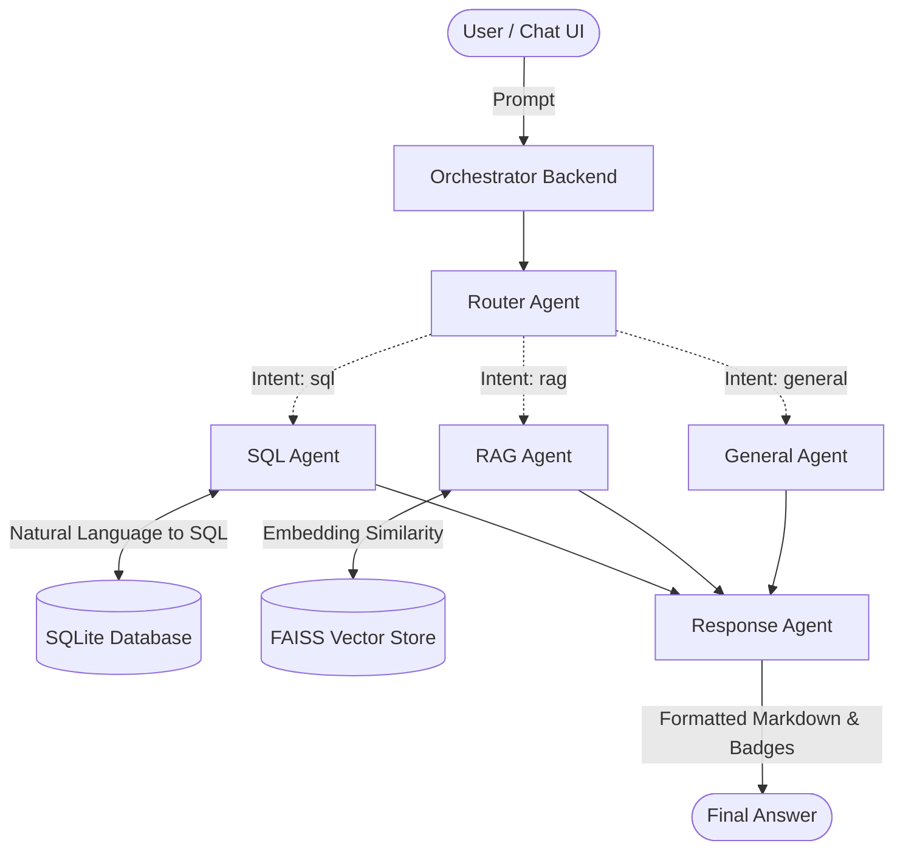

# Project Report: Multi-Agent Generative AI Knowledge Assistant

> **Date:** April 2026
> **Topic:** Intelligent Systems & Multi-Agent Architecture
> **Project Focus:** Retrieval-Augmented Generation (RAG), Text-to-SQL, LLM Orchestration 

---

## 1. Executive Summary

The **Multi-Agent Generative AI Knowledge Assistant** is an advanced, production-structured conversational AI system designed to intelligently process and respond to user queries. By leveraging a multi-agent architectural pattern, the system acts as a highly specialized coordinator that divides tasks among domain-specific AI agents.

This intelligent orchestration routes user prompts to specialized subsystems, including a **Retrieval-Augmented Generation (RAG)** pipeline for document-based queries, a **Text-to-SQL** engine for relational data queries, and a **General AI Assistant** for conversational fallback. All components are bound together by an LLM-powered router and presented through a clean, interactive Streamlit frontend.

---

## 2. System Architecture

The overarching design of the application follows the **Command Pattern** and the **Single Responsibility Principle**. Instead of relying on a monolithic prompt or a single enormous LLM context, tasks are classified and dispatched to deterministic, highly-tuned components.

> **Note:** **LLM Agnosticism:** The system's LLM engine connects via a provider-agnostic factory layer (`llm_client.py`), meaning switching models (e.g., from Anthropic Claude to OpenAI GPT-4o) requires only a single environment configuration change without affecting agent logic.

---

## 3. Multi-Agent Components

The system relies on five distinct agents, extending a generalized `BaseAgent` class to ensure an enforced typed response loop.

### 3.1 Router Agent 🔀
- **Responsibility:** Intent classification and payload routing.
- **Mechanism:** Employs zero-shot classification with deterministic temperature parameters (`temp=0`). It parses user natural-language queries to determine the required computation: `rag`, `sql`, or `general`.

### 3.2 SQL Agent 📊
- **Responsibility:** Natural Language to Database translation.
- **Mechanism:** Injects the current SQLite database schema directly into the context window. Constructs `SELECT` queries based on semantic understanding of data definitions.
- **Guardrails:** Integrates rigorous execution validation. The agent is explicitly blocked from running destructive commands (`UPDATE`, `DROP`, `INSERT`); all generated outputs are parsed to enforce purely read-only analytics. Returns executions as Markdown tables.

### 3.3 RAG Agent 📚
- **Responsibility:** Knowledge-base synthesis and extraction.
- **Mechanism:** When a query targets unstructured reference material, the system embeds the query locally via `sentence-transformers` and searches an in-memory **FAISS** vector store. The top-K overlapping textual chunks are synthesized into a coherent prompt, guaranteeing that the LLM grounds its answers in factual documentation rather than generative hallucinations.

### 3.4 General Agent 💬
- **Responsibility:** Conversational threading and fallback.
- **Mechanism:** Addresses generic questions, greetings, or off-topic prompts using historical context windows to maintain conversational flow.

### 3.5 Response Agent ✨
- **Responsibility:** Output serialization and presentation tuning.
- **Mechanism:** A pure, non-LLM Python processor that normalizes outputs. It appends context-aware aesthetic modifications, such as automated citation of embedded sources, status badges (e.g., 🗄️ Database, 🧠 Knowledge Base), and explicit SQL syntax highlighting tools.

---

## 4. Technology Stack & Tooling

| Domain | Technology / Framework | Justification & Role |
| :--- | :--- | :--- |
| **Logic Orchestration** | `LangChain` | Base framework mapping tools and chaining memory states. |
| **Generative LLM** | `Anthropic Claude / OpenAI` | Foundational models running inference for SQL/Routing/Generation. |
| **Analytics Store** | `SQLite` | Zero-configuration relational backing for Text-to-SQL logic. |
| **Vector Indexing** | `FAISS` | Extremely fast dense vector similarity search algorithm for the RAG chunking algorithm. |
| **Semantic Embeddings** | `sentence-transformers` | Free, locally executing MiniLM transformer model for mapping document texts to vectors. |
| **User Interface** | `Streamlit` | Lightning-fast Python native frontend allowing high-interactivity chat views. |
| **Data Safety & Typing** | `Pydantic` | Statically validates the LLM outputs to map dictionary fields perfectly to Agent properties. |

---

## 5. Security, Memory, & Testing

- **Conversation Memory Singleton:** To maintain chat context without triggering unbounded context token costs, memory instances operate via a rolling sliding-window cache, dropping older state logic natively.
- **Deterministic Validations:** Validates textual generation prior to any functional environment execution loops, specifically prioritizing string-isolation on SQL engine connections.
- **Unit Testing Engine:** CI testing natively mocks asynchronous and external LLM interactions. Leveraging `pytest` and `unittest.mock` allows for executing the full logic suite within milliseconds for free without API exhaustion.

---

## 6. Future Enhancements & Scale Plan

For deploying the tool into an enterprise-scale environment, the architecture supports several drop-in replacements seamlessly:

1. **Persistence Escalation:** Upgrading the local FAISS caching server to managed vector-stores like **Pinecone** or **Milvus** to support million-scale embedding pools. Upgrading SQLite to **PostgreSQL**.
2. **Dynamic Tool Calling Systems:** Transitioning the router to a full *tool-calling* pattern where LLMs can generate a directed acyclic graph mapping multiple required agents per prompt (i.e. summarizing database outputs leveraging document constraints simultaneously).
3. **User Authentication & Deployment:** Encapsulating operations into a containerized `Docker` backend with FastAPI for strict microservices integration across GCP or AWS infrastructure, wrapping the view layer with user-aware Auth tokens constraint algorithms.

---
*Generated for the Multi-Agent Generative AI Knowledge Assistant Project.*
